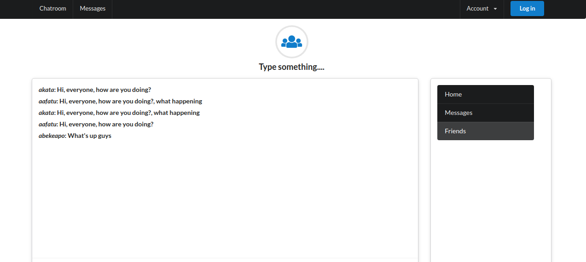

# message_me

This is a Realtime Chat App built with Ruby on Rails.



This is a realtime messaging app, built with Rails, the App allows users to message to everyone on the app. It also uses Action cable for the real time synchronization of messages from users.

## Built With

- Ruby v2.7.0
- Ruby on Rails v5.2.4

## Live Demo

TBA


## Getting Started

To get a local copy up and running follow these simple example steps.

### Prerequisites

Ruby: 2.6.3
Rails: 5.2.3
Postgres: >=9.5

### Setup

Instal gems with:

```
bundle install
```

Setup database with:

```
   rails db:create
